<!-- Improved compatibility of back to top link: See: https://github.com/othneildrew/Best-README-Template/pull/73 -->
<a id="readme-top"></a>

<!-- PROJECT SHIELDS -->
[![Contributors][contributors-shield]][contributors-url]
[![Forks][forks-shield]][forks-url]
[![Stargazers][stars-shield]][stars-url]
[![Issues][issues-shield]][issues-url]
[![MIT License][license-shield]][license-url]
[![LinkedIn][linkedin-shield]][linkedin-url]

<!-- PROJECT LOGO -->
<br />
<div align="center">
  <a href="https://github.com/divyajeetswami5-tech/portfolio">
    
  </a>

  <h3 align="center">Divyajeet Swami Portfolio</h3>

  <p align="center">
    A modern, interactive portfolio showcasing my work as an IT Engineer & Data Science Enthusiast.
    <br />
    <a href="https://github.com/divyajeetswami5-tech/portfolio"><strong>Explore the docs »</strong></a>
    <br />
    <br />
    <a href="https://divyajeetswami5-tech.github.io/portfolio">View Demo</a>
    &middot;
    <a href="https://github.com/divyajeetswami5-tech/portfolio/issues/new?labels=bug&template=bug-report---.md">Report Bug</a>
    &middot;
    <a href="https://github.com/divyajeetswami5-tech/portfolio/issues/new?labels=enhancement&template=feature-request---.md">Request Feature</a>
  </p>
</div>

<!-- TABLE OF CONTENTS -->
<details>
  <summary>Table of Contents</summary>
  <ol>
    <li>
      <a href="#about-the-project">About The Project</a>
      <ul>
        <li><a href="#built-with">Built With</a></li>
        <li><a href="#features">Features</a></li>
      </ul>
    </li>
    <li>
      <a href="#getting-started">Getting Started</a>
      <ul>
        <li><a href="#prerequisites">Prerequisites</a></li>
        <li><a href="#installation">Installation</a></li>
      </ul>
    </li>
    <li><a href="#usage">Usage</a></li>
    <li><a href="#roadmap">Roadmap</a></li>
    <li><a href="#contributing">Contributing</a></li>
    <li><a href="#license">License</a></li>
    <li><a href="#contact">Contact</a></li>
    <li><a href="#acknowledgments">Acknowledgments</a></li>
  </ol>
</details>

<!-- ABOUT THE PROJECT -->
## About The Project

<div align="center">
  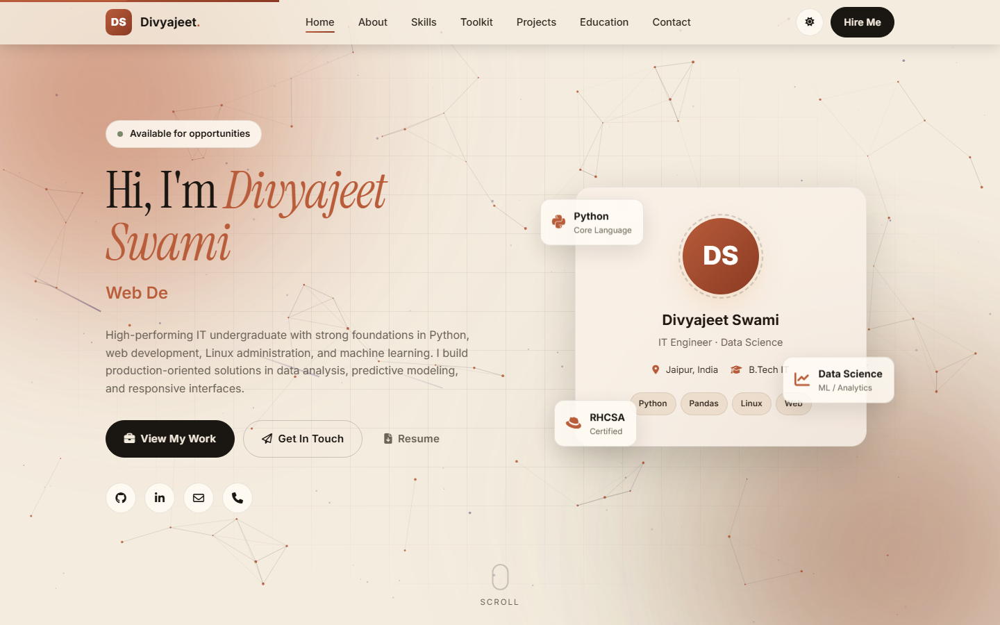
</div>

A modern, interactive personal portfolio designed to feel curated rather than templated. Built on a warm editorial palette with a serif display face, an animated cosmic background, and a constellation of orbiting tool spheres that reveal their role in my workflow on hover.

**Why this portfolio?**

* Looks designed, not generated. Editorial palette and typography choices avoid the "AI default" look.
* Real interactivity. Particles you can push, spheres that respond to focus, and a cinematic horizontal projects scroll inspired by [activetheory.net](https://activetheory.net).
* Zero build step. Static HTML, CSS, and JavaScript. Open `index.html` and it runs.
* Accessible by default. Semantic markup, ARIA labels, keyboard nav, skip link, and `prefers-reduced-motion` respected.

<p align="right">(<a href="#readme-top">back to top</a>)</p>

### Built With

This section should list any major frameworks/libraries used to bootstrap your project. Leave any add-ons/plugins for the acknowledgements section.

* [![HTML5][HTML5]][HTML-url]
* [![CSS3][CSS3]][CSS-url]
* [![JavaScript][JavaScript]][JS-url]
* [![Font Awesome][FontAwesome]][FA-url]
* [![Google Fonts][GoogleFonts]][GF-url]

<p align="right">(<a href="#readme-top">back to top</a>)</p>

### Features

- **Dark/Light Theme** — Toggle between warm carbon and cream paper themes with persistence.
- **Interactive Toolkit** — 12 tool spheres orbit a central core; hover to reveal how each fits into my workflow.
- **Cosmic Background** — Animated star field with drifting auroras and occasional shooting stars.
- **Cinematic Projects** — Horizontal scroll showcase with project cards that lock into view.
- **Hero Particle Network** — Push particles around with your cursor in the hero section.
- **Scroll Progress** — Progress bar at the top shows how far you've scrolled.
- **Back to Top** — Smooth scroll button appears after scrolling down.
- **Mobile Menu** — Hamburger menu with focus trap and ESC to close.
- **Typed Intro** — Typewriter effect cycling through my roles.
- **Animated Counters** — Stats counters animate when scrolled into view.
- **Skill Bars** — Progress bars animate on scroll.
- **Project Filter** — Filter projects by category (Data Science, Web, Application).
- **Contact Form** — Client-side validation that opens your email client with pre-filled content.

<p align="right">(<a href="#readme-top">back to top</a>)</p>

### Preview

A walkthrough of each section.

<table>
  <tr>
    <td align="center"><strong>Hero</strong></td>
    <td align="center"><strong>About</strong></td>
  </tr>
  <tr>
    <td>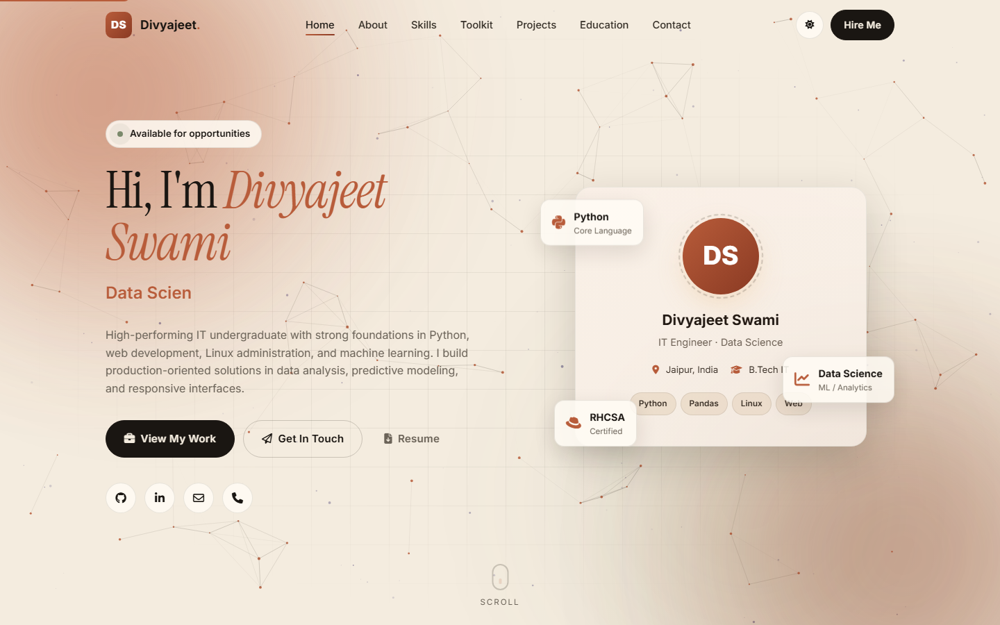</td>
    <td>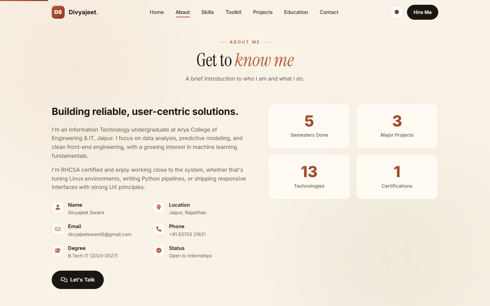</td>
  </tr>
  <tr>
    <td align="center"><strong>Skills</strong></td>
    <td align="center"><strong>Toolkit (idle)</strong></td>
  </tr>
  <tr>
    <td>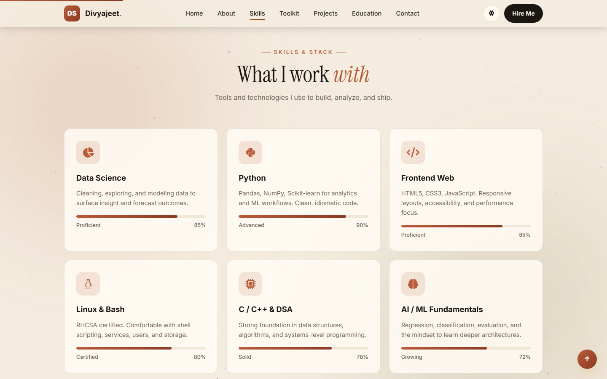</td>
    <td>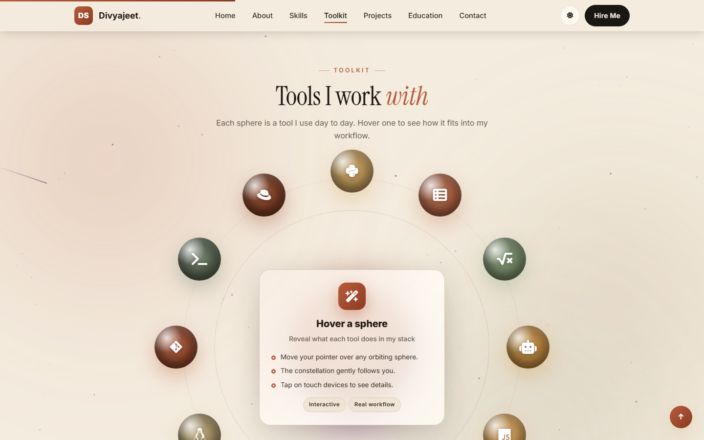</td>
  </tr>
  <tr>
    <td align="center"><strong>Toolkit (hover)</strong></td>
    <td align="center"><strong>Projects</strong></td>
  </tr>
  <tr>
    <td>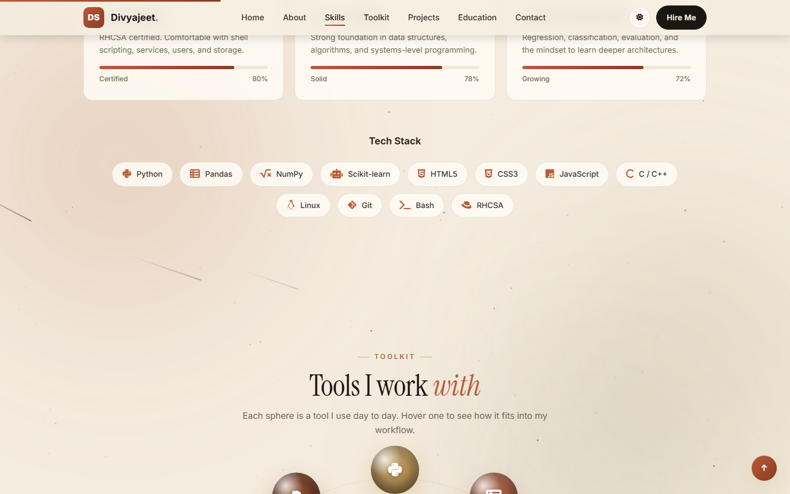</td>
    <td>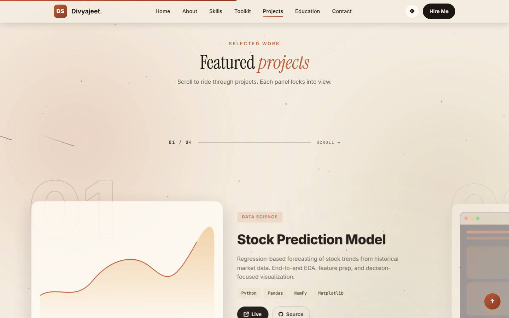</td>
  </tr>
  <tr>
    <td align="center"><strong>Education</strong></td>
    <td align="center"><strong>Contact</strong></td>
  </tr>
  <tr>
    <td>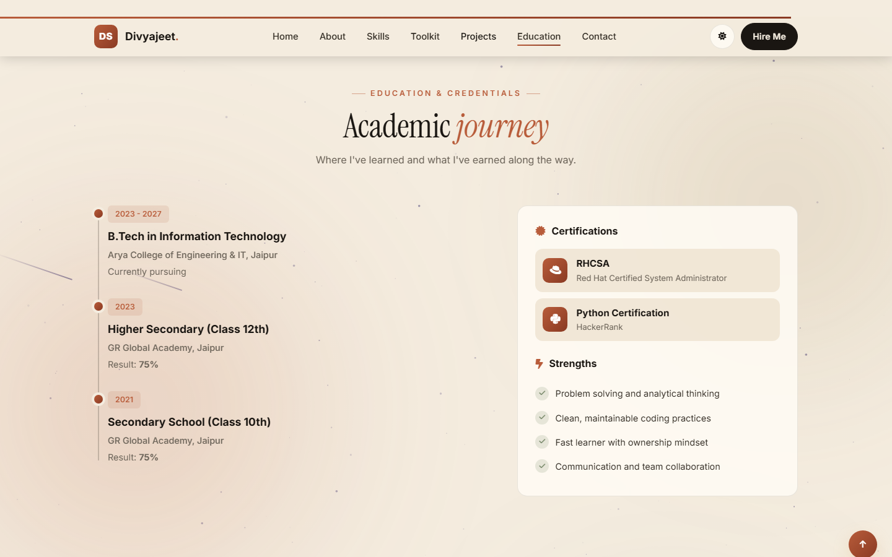</td>
    <td>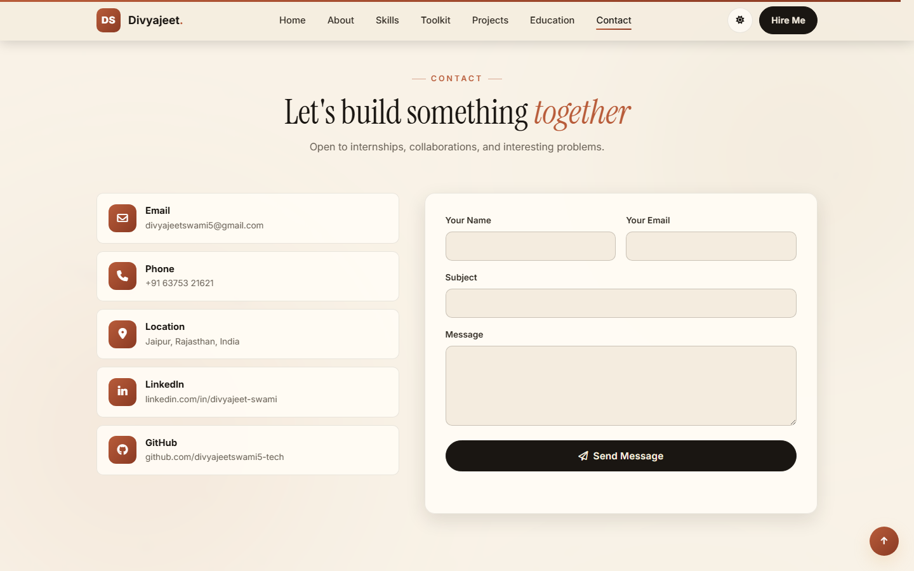</td>
  </tr>
</table>

### Responsive

Audited at 1440 / 834 / 393 widths with no horizontal overflow at any breakpoint. The mobile interface mirrors the desktop experience: same orbit constellation, same horizontal cinematic projects scroll, just at a smaller scale.

<table>
  <tr>
    <td align="center" width="50%"><strong>Tablet (834px)</strong></td>
    <td align="center" width="50%"><strong>Desktop (1440px)</strong></td>
  </tr>
  <tr>
    <td>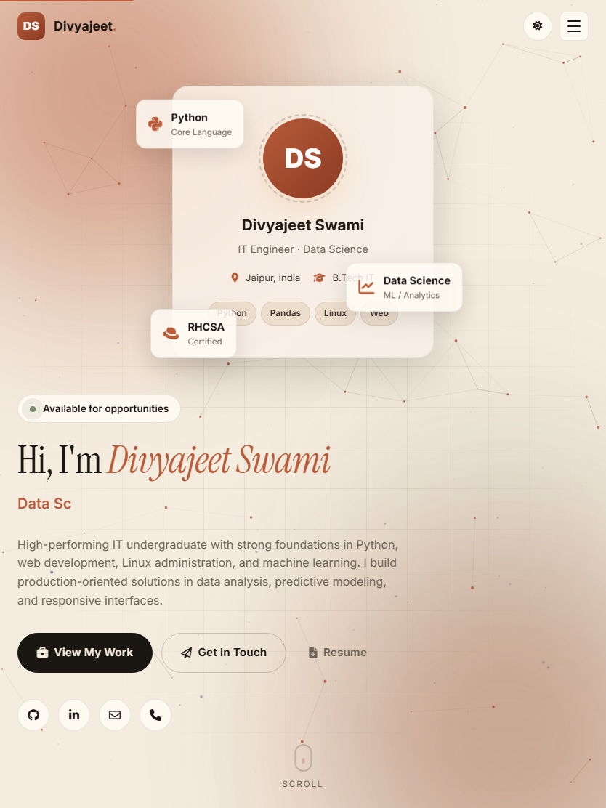</td>
    <td></td>
  </tr>
  <tr>
    <td>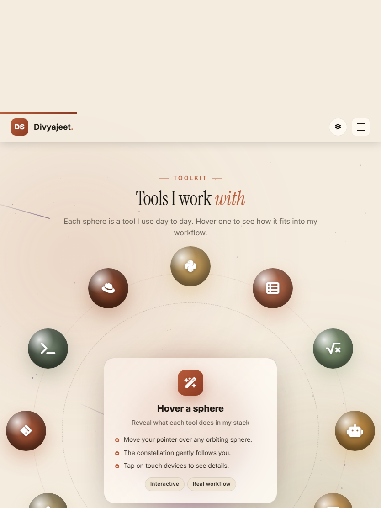</td>
    <td></td>
  </tr>
</table>

<p align="right">(<a href="#readme-top">back to top</a>)</p>

<!-- GETTING STARTED -->
## Getting Started

This is an example of how you may give instructions on setting up your project locally.
To get a local copy up and running follow these simple example steps.

### Prerequisites

This is an example of how to list things you need to use the software and how to install them.

* No build step required — just open `index.html` in a browser.
* For local development with live reload, use any static server.

### Installation

1. Get a free API Key at [https://example.com](https://example.com) *(not required for this portfolio)*
2. Clone the repo
   ```sh
   git clone https://github.com/divyajeetswami5-tech/portfolio.git
   cd portfolio
   ```
3. Open `index.html` in your browser
   ```sh
   # Windows
   start index.html

   # macOS
   open index.html

   # Linux
   xdg-open index.html
   ```
4. For local development with live reload:
   ```sh
   # Python
   python -m http.server 5500

   # Node
   npx serve .
   ```

<p align="right">(<a href="#readme-top">back to top</a>)</p>

<!-- USAGE EXAMPLES -->
## Usage

Use this space to show useful examples of how a project can be used. Additional screenshots, code examples and demos work well in this space. You may also link to more resources.

_For more examples, please refer to the [Documentation](https://github.com/divyajeetswami5-tech/portfolio/wiki)_

### Sections

- **Hero** — Introduction with typewriter effect and social links.
- **About** — Brief introduction and contact info.
- **Skills** — Animated skill bars and tech stack.
- **Toolkit** — Interactive orbiting spheres representing each tool.
- **Projects** — Cinematic horizontal scroll showcase.
- **Education** — Academic timeline and certifications.
- **Contact** — Contact form and social links.

### Customization

- **Palette** — Edit color tokens in `css/styles.css` under `:root`.
- **Toolkit content** — Update the `tools` object in `js/interactive.js`.
- **Sphere colors** — Modify `.s-*` classes in `css/interactive.css`.
- **Hero typewriter phrases** — Change `phrases` in `js/main.js`.
- **Resume link** — Update the hero "Resume" button to point to your actual resume.

<p align="right">(<a href="#readme-top">back to top</a>)</p>

<!-- ROADMAP -->
## Roadmap

- [x] Initial portfolio launch
- [x] Dark/Light theme toggle
- [x] Interactive toolkit with orbiting spheres
- [x] Cinematic horizontal projects
- [ ] Add blog section
- [ ] Add testimonials section
- [ ] Add GitHub activity widget
- [ ] Add analytics (plausible.io or similar)

See the [open issues](https://github.com/divyajeetswami5-tech/portfolio/issues) for a full list of proposed features (and known issues).

<p align="right">(<a href="#readme-top">back to top</a>)</p>

<!-- CONTRIBUTING -->
## Contributing

Contributions are what make the open source community such an amazing place to learn, inspire, and create. Any contributions you make are **greatly appreciated**.

If you have a suggestion that would make this better, please fork the repo and create a pull request. You can also simply open an issue with the tag "enhancement".
Don't forget to give the project a star! Thanks again!

1. Fork the Project
2. Create your Feature Branch (`git checkout -b feature/AmazingFeature`)
3. Commit your Changes (`git commit -m 'Add some AmazingFeature'`)
4. Push to the Branch (`git push origin feature/AmazingFeature`)
5. Open a Pull Request

### Top contributors:

<a href="https://github.com/divyajeetswami5-tech/portfolio/graphs/contributors">
  
</a>

<p align="right">(<a href="#readme-top">back to top</a>)</p>

<!-- LICENSE -->
## License

Distributed under the MIT License. See `LICENSE` for more information.

<p align="right">(<a href="#readme-top">back to top</a>)</p>

<!-- CONTACT -->
## Contact

Divyajeet Swami - [@divyajeetswami5-tech](https://github.com/divyajeetswami5-tech)

Project Link: [https://github.com/divyajeetswami5-tech/portfolio](https://github.com/divyajeetswami5-tech/portfolio)

<p align="right">(<a href="#readme-top">back to top</a>)</p>

<!-- ACKNOWLEDGMENTS -->
## Acknowledgments

Use this space to list resources you find helpful and would like to give credit to. I've included a few of my favorites to kick things off!

* [Best-README-Template](https://github.com/othneildrew/Best-README-Template)
* [Font Awesome](https://fontawesome.com)
* [Google Fonts](https://fonts.google.com)
* [Inter Font](https://rsms.me/inter/)
* [JetBrains Mono Font](https://www.jetbrains.com/lp/mono/)
* [Active Theory Portfolio](https://activetheory.net) (inspiration for cinematic scroll)

<p align="right">(<a href="#readme-top">back to top</a>)</p>

<!-- MARKDOWN LINKS & IMAGES -->
<!-- https://www.markdownguide.org/basic-syntax/#reference-style-links -->
[contributors-shield]: https://img.shields.io/github/contributors/divyajeetswami5-tech/portfolio.svg?style=for-the-badge
[contributors-url]: https://github.com/divyajeetswami5-tech/portfolio/graphs/contributors
[forks-shield]: https://img.shields.io/github/forks/divyajeetswami5-tech/portfolio.svg?style=for-the-badge
[forks-url]: https://github.com/divyajeetswami5-tech/portfolio/network/members
[stars-shield]: https://img.shields.io/github/stars/divyajeetswami5-tech/portfolio.svg?style=for-the-badge
[stars-url]: https://github.com/divyajeetswami5-tech/portfolio/stargazers
[issues-shield]: https://img.shields.io/github/issues/divyajeetswami5-tech/portfolio.svg?style=for-the-badge
[issues-url]: https://github.com/divyajeetswami5-tech/portfolio/issues
[license-shield]: https://img.shields.io/github/license/divyajeetswami5-tech/portfolio.svg?style=for-the-badge
[license-url]: https://github.com/divyajeetswami5-tech/portfolio/blob/master/LICENSE
[linkedin-shield]: https://img.shields.io/badge/-LinkedIn-black.svg?style=for-the-badge&logo=linkedin&colorB=555
[linkedin-url]: https://linkedin.com/in/divyajeet-swami
[HTML5]: https://img.shields.io/badge/HTML5-E34F26?style=for-the-badge&logo=html5&logoColor=white
[HTML-url]: https://developer.mozilla.org/en-US/docs/Web/HTML
[CSS3]: https://img.shields.io/badge/CSS3-1572B6?style=for-the-badge&logo=css3&logoColor=white
[CSS-url]: https://developer.mozilla.org/en-US/docs/Web/CSS
[JavaScript]: https://img.shields.io/badge/JavaScript-F7DF1E?style=for-the-badge&logo=javascript&logoColor=black
[JS-url]: https://developer.mozilla.org/en-US/docs/Web/JavaScript
[FontAwesome]: https://img.shields.io/badge/Font_Awesome-339AF0?style=for-the-badge&logo=fontawesome&logoColor=white
[FA-url]: https://fontawesome.com
[GoogleFonts]: https://img.shields.io/badge/Google_Fonts-4285F4?style=for-the-badge&logo=googlefonts&logoColor=white
[GF-url]: https://fonts.google.com
